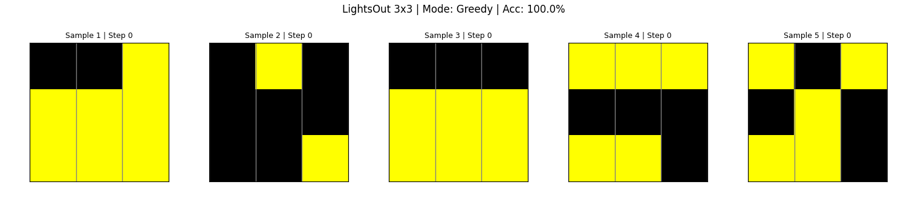

# lightsout-gfn

Experimental [JAX](https://docs.jax.dev/en/latest/) (with [NNX](https://flax.readthedocs.io/en/v0.8.3/experimental/nnx/index.html)) codebase using [GFlowNets](https://milayb.notion.site/The-GFlowNet-Tutorial-95434ef0e2d94c24aab90e69b30be9b3) to solve 3x3 [LightsOut](https://link.springer.com/chapter/10.1007/978-3-642-40273-9_13) puzzles.



_Demo generated with `infer.py`_

Experiment tracking with [MLFlow](https://mlflow.org/).

Dependencies managed with [`uv`](https://docs.astral.sh/uv/).

- **Train**: `uv run -m train`.
- **Monitor**: `uv run mlflow server --host 127.0.0.1 --port 8080`
- **Infer** (with a GUI / to GIF): `uv run -m infer ./some_checkpoint`

## Why?

As of writing, I am very new to both NNX and GFlowNets. This is a way for me to familiarize myself with them, using a toy environment: 'Lights Out!'.

This is a small pilot experiment, cobbled together quickly. Feel free to tell me what I'm doing wrong in the GitHub issues!

## Sample output

Expect convergence in under a minute on a RTX 4060 laptop GPU.

```
❯ uv run -m train
Generated 512 unique board states for N=3.
MLflow Run ID: 4c471d5009c2447b890639de4798ee81
Initializing NNX models...
Optimizer initialized.
Starting NNX training...

--- Eval @ Step 1 --- | Overall Solved=5.4% ---

--- Eval @ Step 1000 --- | Overall Solved=16.3% ---

--- Eval @ Step 2000 --- | Overall Solved=45.1% ---

--- Eval @ Step 3000 --- | Overall Solved=71.9% ---

--- Eval @ Step 4000 --- | Overall Solved=64.9% ---

--- Eval @ Step 5000 --- | Overall Solved=69.6% ---

--- Eval @ Step 6000 --- | Overall Solved=65.5% ---

--- Eval @ Step 7000 --- | Overall Solved=81.8% ---

--- Eval @ Step 8000 --- | Overall Solved=99.0% ---

--- Eval @ Step 9000 --- | Overall Solved=100.0% ---
```

This should converge within tens of seconds on a RTX 4060 laptop GPU.


## Disclaimers and remarks

- A $$N \times N$$ grid has $$2^{N^2}$$ states. For 3x3, this is just $$2^9 = 512$$ states; this is nothing and can easily be memorized. However, the point here was to show that, and how, the GFlowNet training objective could be used in order to learn how to solve this game.
- The code as it stands has data leakage. Partitioning based on starting states is insufficient, due to the effect of sampled actions.
- It would be much more meaningful to do this on bigger grids. Better yet, to use a Transformer or other sequence model in order to generalize across grid sizes.
- There have long been [deterministic solvers for LightsOut](https://github.com/pmneila/Lights-Out). This repository is not attempting to beat them, or to be more than a proof of concept.


## License

MIT licensed. See `./LICENSE`.
